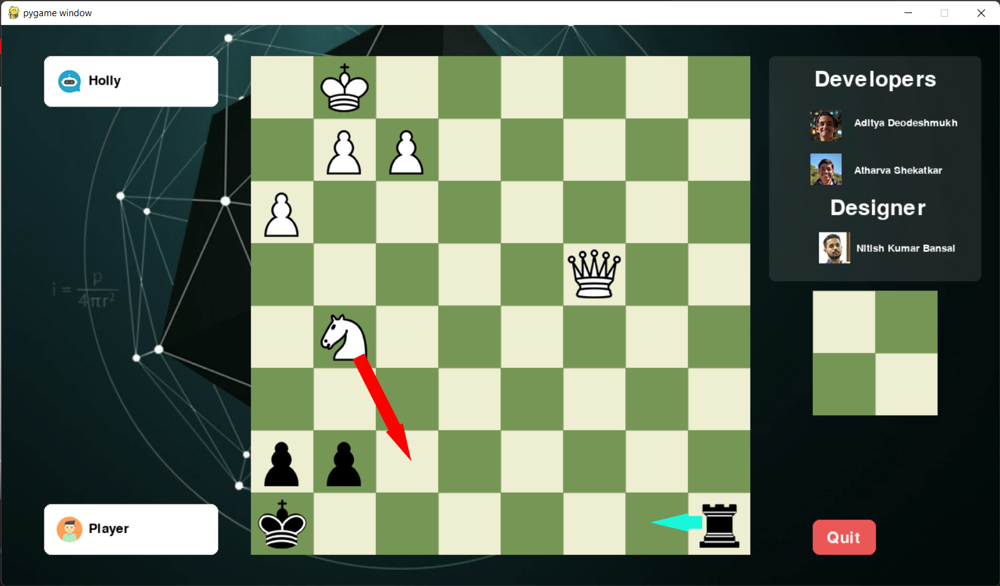
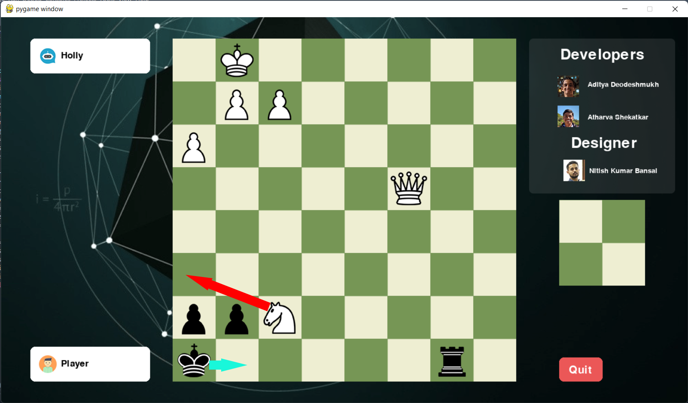
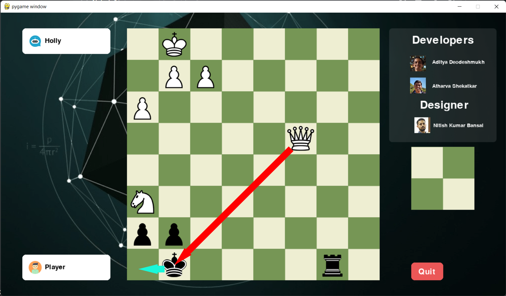
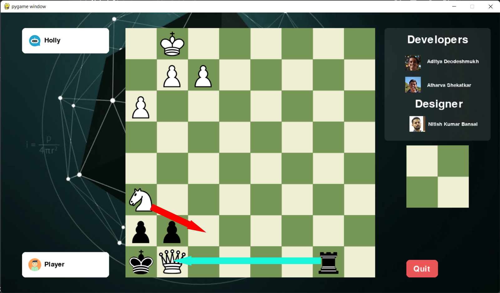
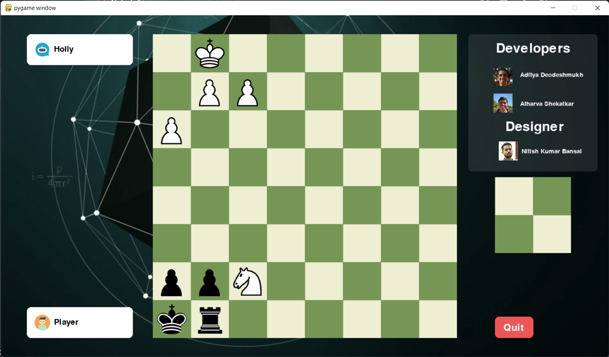
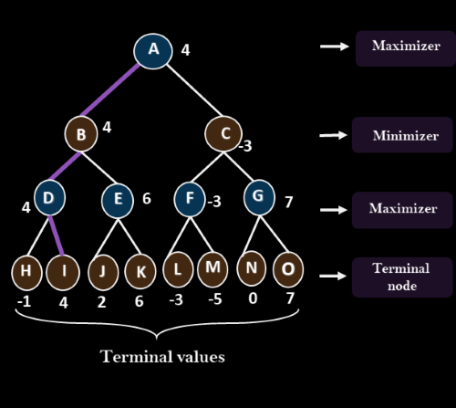
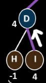
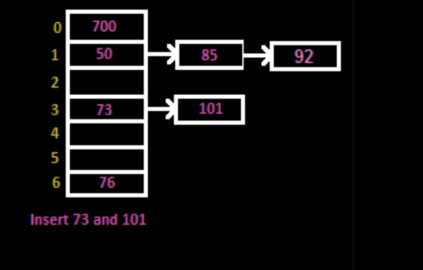

# ChessBotAI
A chess game with an AI bot which can play as the opponent.

## Installation
In order to run the game, you need have `python 3` installed, along with `pygame` and `cppyy` modules
Python 3 can be downloaded and installed from the official python website. Pygame and cppyy can be installed using the `pip` command. 
The links to documentation for installation of above requirements are provided below:

[Python](https://wiki.python.org/moin/BeginnersGuide)

[Pygame](https://www.pygame.org/wiki/GettingStarted)

[Cppyy](https://cppyy.readthedocs.io/en/latest/installation.html)

If you are running the game on windows, you will also need Microsoft Visual Studio Build Tools. You can find it on the [Microsoft Visual Studio website](https://visualstudio.microsoft.com/downloads/) by opening the drop down menu labelled ***Tools for Visual Studio 2022***
## Screenshots
In this section we shall see how the AI performs when given certain positions. We shall see if the bot is able to take an obvious advantage in a position, be it a checkmate or an advantage in material.
The moves highlighted by red are made by the AI and blue are made by the player.

Smothered Mate

In this section we will see how the AI performs a smothered mate which involves mating the king by surrounding the king with its own pieces and then checking the king.

  
  
    Move 1: Rb8 Nf7
  The rook moves on a random square on the back rank and now we can setup a smothered mate. The AI first gives a check by moving the knight to the f7 square.

 

  Move 2: Kg8 Nh6
  Now the king has to move to g8 in order to escape check. However, the knight moves to h6 as this comes with a double check. This prevents black from capturing the knight with his pawn.
  
   
  
  Move 3: Kh8 Qg8
  Now the black king has to move to h8 to escape the check. If the king moves to f8 then Qf7 is checkmate. So the king moves to h8. Then queen moves to the g8 square for a brilliant sacrifice.
  
 
  
   Move 4: Rxg8 Nf7
    Now black is forced to take the queen of g8 with their rook as capturing with king is illegal due to the queen being protected by the knight. This traps the rook in the corner and knight to f7 ends in a checkmate
  
 

   
  
  Checkmate! :)

## Running the game
Open the file labelled `ChessUI.py` in any IDE which supports Python3 and press _run_. If you only have the Python interpreter installed, you can simply double-click the file to run it. 
**Note:** Python interpreter needs to be restarted after quitting the game each time, else the game will not load and will show errors. 
## Working

The algorithm used in the bot is a **Minimax algorithm** with **Alpha-Beta Pruning**. 
Minimax algorithm involves using **Depth First Search** upto a certain depth and calculating the advantage for BLACK or WHITE at the position based on certain heuristic values. 
 

 
 
In this graph, the values at the leaf nodes is calculated using certain heuristic functions.
These functions are prepared by consultation from **experts** in the field i.e. Strong chess players.
 
For example, a piece such as a kinght is good in the middle of the board, so a heuristic function will prefer a knight to be in the middle of the board rather than at the edges.
 
 
Finally these values are passed upwards in an **alternating minimum-maximum** fashion.
 
As we can see the node at depth 3 are maximizers so we select the move has the maximum value from the nodes below it.
 
 

 
 
For example at the node D, we select the value at I which is 4 since that is the maximum value at the nodes below it.
 
Similarly at depth 2 we select the the move that has the maximum value below it. 
 
 

 
 
At node B, we select the value at node D which is 4 as that is the minimum value below it.
 
Along with this we have used **Zobrist Hashing** to reduce the number of computations we need to do for calculating the value of a position.
 
In this method we generate unique random numbers for a certain position and store that value in a hash table along with the evaluation of that position.
For this application, we have used a 32-bit hash table with 64 bit zobrist key. To deal with collisions we have implemented separate chaining and stored the evaluations one after another.
 
 

